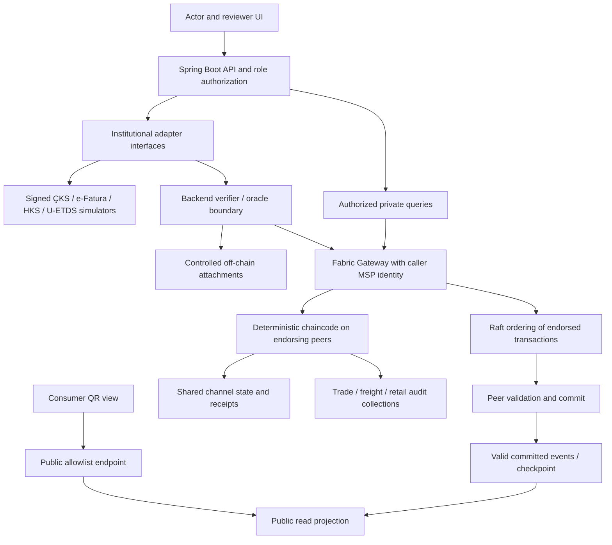

# AgroChain — architecture contract

Status: Stages 1–6 implemented. The normative companions are [product scope](PRODUCT_SCOPE.md), [data contracts](DATA_CONTRACTS.md), [security](SECURITY_AND_PRIVACY.md) and [state machines](STATE_MACHINE.md). Stage 6 runtime behavior is described in [the UI guide](STAGE6_UI.md).

## Stage 6 implementation (2026-09-23)

Spring Boot serves a small same-origin HTML/CSS/JavaScript UI without a second
application framework. A restart-safe reconciliation worker finds unevaluated
retail reports from the replayable valid-event projection. The Regulator oracle
computes an exact integer score, journals its operation and submits EvaluatePrice.
Both endorsers rederive the score from committed PDC inputs and immutable ledger
policy. Review actions require the Regulator reviewer certificate role.
Evaluation and review increment the batch version and append receipts without
changing RETAIL_REPORTED. Public events contain opaque IDs only. All scoring,
classification, review text and fresh salts stay in retailAuditPrivate.

The UI uses manually provisioned local bearer credentials, kept in page memory;
tokens are never embedded in HTML, URLs or browser storage. Consumer pages call
only the explicit public projection. QR generation is local, with no external QR
service. The threshold environment setting must exactly agree with ledger policy;
a mismatch keeps reports pending and retries after configuration is corrected.

## Stage 5 implementation (2026-09-22)

Spring Boot and Java Gateway now implement the application boundary, with four
in-process signed institutional simulators, per-actor bearer authentication/MSP
signers, a SQLite operation journal and protected originals. A valid-event consumer
builds an explicit public projection with checkpoint/transaction deduplication.
See [backend API and configuration](../backend/README.md) and
[executed acceptance](STAGE5_REPORT.md). The earlier Stage 4 status above is
historical; Stage 6 now implements anomaly/review logic and UI.

The concrete HTTP contract receives an opaque operation ID from the client and
requires the matching Idempotency-Key, then journals it before submission. It never
allocates a new ID on retry. This resolves step 1's earlier allocation wording below.
InstitutionalAdapter.Request carries a typed command/batch and source/type/scenario;
the public signed document schema remains unchanged. VerifyOriginal is an internal
byte-match helper; the HTTP integrity response separately verifies ledger trust,
signature, commitment and original digest and returns the specified result DTO.

## Minimal deployment

One local Docker Compose project: four peers (`ProducerMSP`, `LogisticsMSP`, `RetailerMSP`, `RegulatorMSP`), one `agrochannel` channel, and three Raft orderers under a separate `OrdererMSP`. The Stage 2 request supersedes the original `agrochain` channel name and single-orderer assumption. One anchor peer represents each application organization. Three orderers tolerate one crashed node while quorum remains; Raft is not Byzantine fault tolerant. One host/operator still controls all ordering nodes, so organization identities do not demonstrate independent infrastructure or resistance to host compromise. A Go business chaincode package is deferred to Stage 3; Stage 2 installs no chaincode.

Use Fabric's embedded LevelDB for world state, key-based lookups and explicit append-only domain receipts. CouchDB is unnecessary. Java/Spring Boot uses the supported Fabric Gateway Java client. A simple browser UI is delivered in Stage 6; select its small framework at that stage. A local SQLite application database holds operation tracking, read projections and document metadata, with controlled filesystem storage for synthetic attachments. It is neither consensus state nor a substitute for PDC authorization.

Stage 2 pins Fabric 2.5.15 images/binaries and the official Linux amd64 CLI archive checksum in `network/.env.example`. Development MSP and TLS identities use cryptogen; certificate lifecycle/revocation management requires Fabric CA or institutional PKI outside this stage. Cryptogen does not issue the `agrochain.role` business attributes: later role-bearing identities must satisfy the unchanged security contract. Go dependencies, Java/JDK and Gateway versions are deferred to the stages that introduce them. The [network guide](../network/README.md) defines Linux x86-64, Docker Engine >=24 and Compose >=2.20 prerequisites. A 16 GB RAM / 20 GB free-space baseline remains an assumption, not a measured minimum.

The arrows describe distinct proposal, order and commit phases; chaincode does not call the orderer or an external service itself. Only valid committed transactions update projections.

## Responsibility boundaries

| Component | Owns | Must not claim/do |
| --- | --- | --- |
| Institutional adapter | Typed requests, source-specific mapping to normalized signed documents, transport timeout/error translation | Grant chaincode permissions, declare physical truth, disguise simulated origin |
| Signed simulator | Synthetic, reproducible scenario values; source key; stable document ID/nonce for retried request | Present signatures as ministry-issued or silently regenerate a consumed document |
| Backend/oracle | Authenticate application caller; choose its MSP signer; fetch documents; verify signature/key/binding/attachment; validate tax and units; stage files; submit transient payloads; wait for commit | Use one regulator identity for all callers; return success merely on submission; put prices in public arguments |
| Gateway | Send signed proposals to eligible endorsers, collect endorsements, submit, obtain commit status | Interpret institutional truth or replace domain checks |
| Chaincode | MSP/role checks, evidence signature and commitment recheck, state machine, quantities, uniqueness, receipt/event writes, deterministic score attestation | HTTP, Redis, filesystem lookups, environment-dependent rules, random generation, wall-clock reads |
| Shared ledger | Organization-level provenance, ownership/custody, lifecycle, opaque evidence references/commitments, immutable operation receipts | Full invoice, raw prices, review allegations or personal identity fields |
| PDCs | Selected normalized commercial records, evidence openings, detailed anomaly results/reviews | Universal public confidentiality, legal compliance or protection from member administrators |
| Read model/UI | Rebuildable public projection; authorized private query views; explicit provenance/status labels | Invented success, frontend-only access control, stale projection presented as current |

## Institutional interfaces and simulator boundary

Define an `InstitutionalAdapter` interface with `fetchEvidence(request) -> SignedDocumentBundle` and `verifyOriginal(documentId, bytes) -> IntegrityResult`. A request carries `schemaVersion`, `sourceSystem`, `documentType`, `batchId`, `boundOperationId` and source-specific lookup fields. HTTP transport, if used, is a local simulator endpoint; in-process adapters in one backend deployment are also sufficient. Source keys are isolated from verifier configuration even when both run on the same demo host.

| Adapter | Normalized claim | Consuming command |
| --- | --- | --- |
| ÇKS / `CKS` | Producer reference registered for tomatoes for this batch and quantity; synthetic eligibility assertion, not a description of the real ÇKS response schema | `CreateBatch` |
| e-Fatura / `EFATURA` | One purchase invoice, producer seller → retailer buyer, whole batch, TRY price and total; separate freight invoice logistics → retailer | `OfferPickup`; `RecordFreightCost` |
| HKS / `HKS` | Synthetic notification for this producer → retailer movement with batch and quantity | `OfferPickup` |
| U-ETDS / `UETDS` | Synthetic carrier/consignor/consignee and whole-batch transport manifest | `OfferPickup` |

All four return `sourceMode=SIMULATED` and distinct allowlisted issuer/key identities. An unavailable simulator is a dependency failure, not permission to fabricate an unsigned success. No real API adapter is implemented or implied. A future adapter maps authenticated real records into a versioned normalized attestation and archives the original; its signer and provenance model require review. A real institution's native signature must not be invented or relabeled as the adapter's own signature.

## Write and recovery flow

1. API authenticates the operator and maps its role to a permitted MSP signer. It allocates an opaque operation ID and stages the request in SQLite, before any Fabric submission.
2. It obtains signed evidence, validates schema, signature, issuer/type binding, batch/operation binding, quantity, unit basis and original attachment bytes. The backend is an oracle for mapping real-world claims, not a truth engine.
3. Public arguments contain only the command envelope and approved shared fields. The transient map carries commercial values, document bodies, private salts and PDC record salts. The proposal signer remains the actor; the Gateway peer and endorsers are restricted to `RetailerMSP` and `RegulatorMSP` for private-bearing writes.
4. Chaincode repeats consensus-critical checks from signed normalized evidence, uses ledger trust/configuration, executes the transition and atomically writes public receipt, evidence-use indices and affected private records. Malformed or rejected input produces no state change.
5. The backend returns committed success only after a `VALID` commit. It then promotes staged attachment metadata. A timeout with unknown commit outcome returns pending, retains the operation ID and reconciles against its receipt; it must not create a fresh operation and blindly retry.
6. An event consumer records its block/transaction checkpoint and deduplicates by transaction ID. On crash it replays valid events. A separate reconciliation pass repairs committed-but-unprojected records and committed-but-staged files. Unsubmitted staged files can be expired; files associated with unresolved submissions cannot be discarded automatically.

The Gateway may receive a proposal signed by another organization's client; Stage 2 verifies admin/client channel queries, while Stage 4/5 must verify private-proposal ACLs and explicit endorser targeting for this deployment. Never route freight plaintext through a Producer peer, or audit plaintext through Producer/Logistics peers. Private reads target a member peer and enforce both MSP and client role. Fabric's transient-data routing considerations are documented in [Fabric Gateway](https://hyperledger-fabric.readthedocs.io/en/latest/gateway.html).

## Determinism and time

Endorsers must produce equivalent results from the same proposal and ledger version. HTTP responses, Redis contents, local files, local environment variables, randomness, and `now()` can differ between peers or attempts. Therefore chaincode accesses only proposal arguments/transient data, authenticated creator attributes, transaction context and ledger state. Redis and external APIs are backend concerns only.

The backend generates random IDs/nonces/salts before submission. It never asks endorsers to generate them. Contract thresholds and trusted source keys live in ledger configuration, not per-peer environment variables. Sort unordered collections before serialization.

Use `GetTxTimestamp()` as the consistent transaction attribute and persist the full seconds/nanoseconds pair. It is derived from the client's proposal, not a trusted physical clock; see the [chaincode interface definition](https://github.com/hyperledger/fabric-chaincode-go/blob/main/shim/interfaces.go). The backend may enforce a configurable operational clock-skew check (default five minutes) using its own clock, but authorization, ownership and replay prevention cannot depend on it. Use operation sequence/version and commit order for lifecycle order. Document `issuedAt` remains a source assertion. No time-based legal deadlines are implemented.

## Consensus, events and optional components

Raft orders endorsed transactions; peers validate endorsement and version conflicts before applying them. A submitted or ordered transaction may still be invalid. The three-node pilot uses crash fault tolerance, not Byzantine fault tolerance, and retains a shared-host failure boundary; see the [Fabric ordering model](https://hyperledger-fabric.readthedocs.io/en/latest/orderer/ordering_service.html).

Kafka, if ever needed, would ingest application events after commit. It is not the selected Fabric consensus mechanism. A resumable Gateway event consumer and SQLite checkpoint are sufficient for this pilot. Redis caching/queues are also deferred until a measured need exists; neither becomes a source of consensus data.

## Application API surface

Routes are under `/api/v1`. Stages 5–6 implement lifecycle, document, operation-status, public-lot, anomaly and review endpoints. Mutations require authenticated actor role and `Idempotency-Key` equal to `operationId`. Exact implemented request/response examples are in the backend and UI guides.

| Route | Responsibility |
| --- | --- |
| `POST /batches` | `CreateBatch` |
| `POST /batches/{id}/pickup-offers` | `OfferPickup` |
| `POST /batches/{id}/pickup-acceptances` | `AcceptPickup` |
| `POST /batches/{id}/delivery-offers` | `OfferDelivery` |
| `POST /batches/{id}/delivery-acceptances` | `AcceptDelivery` |
| `POST /batches/{id}/freight-costs` | `RecordFreightCost` |
| `POST /batches/{id}/retail-reports` | `ReportRetailPrice` |
| `POST /batches/{id}/anomaly-evaluations` | Regulator service calls `EvaluatePrice` |
| `POST /anomalies/{id}/review-actions` | Reviewer calls `OpenReview` or `ResolveReview` |
| `GET /batches/{id}`, `GET /batches/{id}/history` | Authenticated shared-state queries |
| `GET /batches/{id}/commercial`, `GET /anomalies/{id}` | Role/member-filtered private queries, no generic collection/key selector |
| `POST /documents/{id}/verify` | Authorized original-byte comparison against committed evidence |
| `GET /operations/{operationId}` | Caller-scoped recovery/commit status |
| `GET /public/lots/{lotId}` | Consumer allowlist only |

Anomaly computation is eventually completed after the retail report. Until its valid commit, UI says `EVALUATION_PENDING`, not normal. Operations and private queries are access-controlled independently of guessed IDs. A projection exposes its `asOfBlock` and transaction reference, and may explicitly report lag. Public endpoints cannot fall back to a generic private batch serializer.

## Configuration governance

Bootstrap configuration stores the four source public-key allowlists and immutable `CFG-PRICE001` (`price-increase-v1`, `thresholdBps=5000`). Source registry records contain issuer/system/type bindings, key ID, 32-byte public key and enabled status. Default demo keys are generated locally and marked development-only. Private keys never enter channel state.

Both retailer and regulator must approve initialization through endorsement. Chaincode initialization is single-use and restricted to a Regulator admin identity. No runtime key/threshold mutation API is in v1: changing a policy or trust key requires a reviewed new configuration version and chaincode upgrade procedure in a later contract revision, or a clearly labeled destructive demo reset. Existing evidence and report snapshots must never be reinterpreted silently. The backend may read `ANOMALY_PRICE_INCREASE_THRESHOLD_PERCENT=50` at bootstrap, convert exactly to basis points and require agreement with ledger configuration; a mismatch stops scoring.
