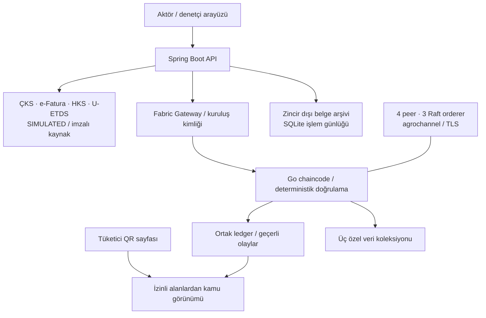

# AgroChain teknik özeti

Gerçek yerel Hyperledger Fabric 2.5.15 ağı: ProducerMSP, LogisticsMSP,
RetailerMSP, RegulatorMSP; her birinde bir peer, ayrı OrdererMSP altında üç
Raft orderer. Bir makine yöneticisi tüm altyapıyı kontrol eder. Kuruluşlar ayrı
MSP kimlikleriyle temsil edilir, bağımsız fiziksel işletim iddiası yoktur.

Chaincode dış API çağırmaz. Backend kaynağı alır, doğrular, komut ile transient
özel veriyi Gateway'e gönderir. Retailer ve Regulator endorsement gerekir.
Backend sabit role bağlı tokenı, chaincode sertifika MSP/rolünü kontrol eder.
Başarılı yanıt ancak VALID sonucu sonrası COMMITTED olur. Belirsiz gönderim
kalıcı günlüğe alınır ve aynı işlemle uzlaştırılır.

Yaşam döngüsü: CREATED → PICKUP_PENDING → IN_TRANSPORT → DELIVERY_PENDING →
RECEIVED → RETAIL_REPORTED. Her komut beklenen sürümü ve benzersiz operationId'yi
taşır. Yetkisiz transfer, imkânsız miktar, tekrar ve geçersiz geçiş reddedilir.
Zincir olay zamanı Fabric işlem bağlamından gelir.

| Saklama alanı | İçerik / erişim |
| --- | --- |
| Ortak ledger | Parti, miktar, sahiplik, yaşam döngüsü, belge taahhüdü ve doğrulama referansları |
| tradePrivate | Alış: Producer, Retailer, Regulator |
| freightPrivate | Nakliye: Logistics, Retailer, Regulator |
| retailAuditPrivate | Raf, analiz, inceleme: Retailer ve uygun Regulator rolleri |
| Zincir dışı | Özgün belge, kontrollü arşiv, işlem günlüğü, okunabilir projeksiyon |

Belge bütünlüğü saltlı taahhüt, Ed25519 kaynak imzası ve belge özetini birlikte
doğrular. Saltlar ortak/tüketici verisine girmez. Simülatör anahtarları geliştirme
anahtarlarıdır. Tüketici API'si ayrı alan listesi kullanır.

Analiz: `(rafKurus − alisKurus) × 10000 / alisKurus`. Karar yuvarlanmadan,
çapraz tamsayı çarpımıyla eşik aşımından verilir. Sıfır alış veya eksik kanıt
normal sonuç üretmez. Backend önerisini chaincode tekrar hesaplar. İnceleme
durumları OPEN → IN_REVIEW → RESOLVED olup fiyat sonucunu değiştirmez.

Tam sözleşme: [ARCHITECTURE](../ARCHITECTURE.md), [veri modelleri](../DATA_CONTRACTS.md),
[gizlilik](../SECURITY_AND_PRIVACY.md). Test kanıtı: [Aşama 7](../STAGE7_REPORT.md).
