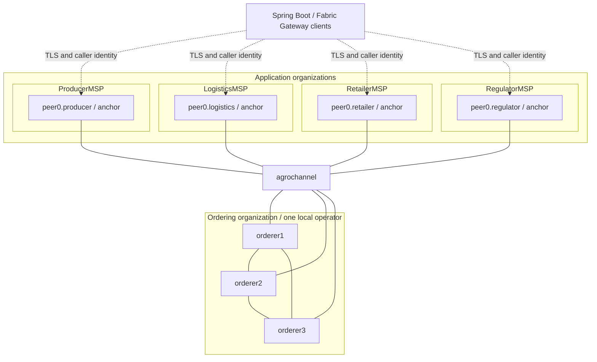

# AgroChain local Fabric network — Stage 2

Stage 3/4 extension: the network supports four TLS CCAAS services via
`compose/compose-chaincode.yaml`. [Chaincode documentation](../chaincode/agrochain/README.md)
describes build/deploy/test/upgrade commands. `make network-down` stops these first;
`make network-up` restores them when generated service configuration exists.
No Stage 2 ledger volume or identity is replaced.

Stage 7 adds an opt-in isolated ledger prefix for clean acceptance runs;
`AGROCHAIN_LEDGER_VOLUME_PREFIX=agrochain-stage7-<12 lowercase hex>` names seven
disposable test volumes. It is bound to the generated identity manifest. The
default remains `agrochain`; do not change a populated workspace's prefix.
Use the managed [Stage 7 runner](../docs/STAGE7_TESTING.md) to preserve the existing
network, test fresh workspaces sequentially and restore it afterward.

`make verify` retains topology, TLS, MSP/channel, lifecycle-query and peer-restart
checks while allowing deployed chaincode. To assert the original Stage 2 empty
chaincode condition on an undeployed network, use `AGROCHAIN_VERIFY_EMPTY=1 make verify`.
Use `make privacy-prepare` and `make stage4-check` to verify the deployed definition,
signed lifecycle and PDC behavior. See the [Stage 4 runbook](../docs/STAGE4_PRIVACY.md)
for Python cryptography/JDK requirements; network health alone proves no business flow.

Linux x86-64 competition pilot: four application organizations, one peer and anchor
each, `agrochannel`, and three TLS-enabled Raft orderers in a separate `OrdererMSP`.
Stage 4 business chaincode is deployed; Stages 5–8 add backend, institutional
simulators, UI and the [final competition package](../docs/competition/README.md).
See [Stage 2 evidence](../docs/STAGE2_REPORT.md) for executed checks and limitations.



## Trust and scope

Producer represents the producer/agricultural-source role; Logistics the carrier;
Retailer the retailer; Regulator audit/review. These are independent MSP identities,
not independently administered machines. One operator controls the separate ordering
MSP and all three orderers. Raft requires two of three orderers and tolerates one
crashed orderer; it does **not** tolerate malicious orderers or a failed shared host.
Node outage tolerance is a topology property, not a Stage 2 fault-injection claim.

`cryptogen` creates separate enrollment and TLS CAs per organization, node-specific
keys/certificates, an Admin and a User1 client per application organization, and
ordering administrator TLS credentials. Cryptographic keys are deliberately random;
the workflow and topology are repeatable, not byte-identical across resets. Generation
uses a restrictive umask and a manifest; reruns preserve identities. These are
development-only credentials. Production identity management requires Fabric CA or
institutional PKI with issuance controls, renewal and revocation.

Cryptogen NodeOUs distinguish admin/client/peer/orderer. It does **not** issue the
`agrochain.role` attributes required by the domain contract. Stage 4's `privacy-prepare`
issues development role-bearing certificates using the generated CAs; Stage 5 must
provision separate application signers. No business permission is inferred from User1
or administrative credentials, and the Stage 1 role contract is not weakened.

Channel application admins use majority governance; lifecycle approval uses majority
application endorsement. The default transaction endorsement policy is
`AND('RetailerMSP.peer','RegulatorMSP.peer')`, as specified in Stage 1. These are distinct
policies. Actual business endorsement and private-data access await chaincode tests.
Orderer organization administrators control the ordering organization; channel-level
governance follows the explicit policies in configtx.

## Prerequisites and versions

The canonical pins are [`.env.example`](.env.example), read directly by scripts; no
`.env` copy is necessary or loaded. Both images are exact tags:

- `hyperledger/fabric-peer:2.5.15`
- `hyperledger/fabric-orderer:2.5.15`
- Fabric CLI archive `hyperledger-fabric-linux-amd64-2.5.15.tar.gz`, including
  `peer`, `cryptogen`, `configtxgen`, `configtxlator`, `osnadmin` and `config/core.yaml`.

Use Docker Engine >=24 and the Compose plugin >=2.20 (later major versions accepted),
Bash >=4, Python >=3.10, GNU make/coreutils, jq >=1.6, OpenSSL >=1.1.1, curl and tar.
No Go/JDK/Node install is needed for this stage. The initial hardware assumption is
16 GB RAM / 20 GB available disk, not a measured minimum. Docker Desktop is not used.
Exact locally tested tool versions are in the evidence report.

On Arch Linux, an administrator can install `docker docker-compose python jq openssl
make curl tar` with `pacman -Syu`, then enable/start the daemon with
`systemctl enable --now docker`. These are documented administrator actions; project
scripts do not run them or use sudo. Membership in the `docker` group permits daemon
access and is effectively root-equivalent; choose this deliberately and log out/in
after membership changes. Check access with `docker info` from the intended user.
See [Arch Docker guidance](https://wiki.archlinux.org/title/Docker).

Explicit Arch administrator commands (not invoked by project scripts):

```bash
pacman -Syu docker docker-compose python jq openssl make curl tar
systemctl enable --now docker
```

If choosing Docker group access, the administrator can use
`usermod -aG docker YOUR_LOGIN_NAME`; then start a new login session before testing.

Verify tools without changing the host:

```bash
docker version
docker compose version
docker info
python3 --version
bash --version
jq --version
openssl version
make --version
```

Install the official release archive **explicitly**, from the repository root. This
does not install system-wide binaries or execute a downloaded installer script:

```bash
source network/.env.example
mkdir -p network/tools
curl --fail --location --proto '=https' --tlsv1.2 \
  "https://github.com/hyperledger/fabric/releases/download/v${FABRIC_VERSION}/hyperledger-fabric-linux-amd64-${FABRIC_VERSION}.tar.gz" \
  --output network/tools/fabric.tar.gz
printf '%s  %s\n' "$FABRIC_LINUX_AMD64_SHA256" network/tools/fabric.tar.gz | sha256sum --check
tar -xzf network/tools/fabric.tar.gz -C network/tools
network/tools/bin/peer version
network/tools/bin/cryptogen version
network/tools/bin/configtxgen --version
network/tools/bin/configtxlator version
make check
```

The archive SHA256 is pinned from official release metadata. `osnadmin` has no
version flag in this release, so preflight verifies its exact released binary hash.
Alternatively set `FABRIC_BIN_DIR` and `FABRIC_CLI_CONFIG_DIR` to an existing matching
release. Image tags are pinned; record/cache their resolved digests for an offline
demo (`docker image inspect ...`). Preload with `docker pull` or verified `docker load`.
Bootstrap may pull these exact images if absent; it installs no host packages/tools.

## Ports and TLS

All published ports bind to `127.0.0.1`. Names below have suffix `.agrochain.test`.
Docker-internal DNS resolves them; no `/etc/hosts` edit is required.

| Node | Host TLS/gRPC | Host mutual-TLS admin | Internal address |
| --- | --- | --- | --- |
| peer0.producer | 7051 | — | peer0.producer:7051 |
| peer0.logistics | 8051 | — | peer0.logistics:7051 |
| peer0.retailer | 9051 | — | peer0.retailer:7051 |
| peer0.regulator | 10051 | — | peer0.regulator:7051 |
| orderer1.orderer | 7050 | 7053 | orderer1.orderer:7050 |
| orderer2.orderer | 8050 | 8053 | orderer2.orderer:7050 |
| orderer3.orderer | 9050 | 9053 | orderer3.orderer:7050 |

Preflight tests availability of these ten ports and accepts bindings owned by an
already-running AgroChain container. Peer CLI/Gateway and orderer broadcast/deliver
use server-authenticated TLS plus signed Fabric requests; Raft uses node TLS
certificates. The orderer participation API additionally requires a trusted client
TLS certificate. There is no insecure published API. Internal `/healthz` HTTP is
bound to each container's loopback on 9443 and never published. Health checks read
its HTTP status, not just a TCP socket.

## Lifecycle

From the repository root:

```bash
make check            # Read-only dependency, exact CLI version, syntax, port checks
make bootstrap        # check -> generate -> network-up -> channel-create
make verify           # Real CLI/TLS/configuration checks; restarts each peer
make smoke            # Stop -> bootstrap/verify -> stop -> bootstrap/verify
make network-down     # Remove containers/network; preserve named ledger volumes
make clean-generated  # DESTRUCTIVE: only named demo volumes and generated artifacts
```

Individual `make generate`, `make network-up`, and `make channel-create` targets are
also supported. Scripts resolve their own directory; e.g.
`bash /path/to/AgroChain/network/scripts/verify.sh` works from elsewhere, as does
`make -C /path/to/AgroChain bootstrap`. Commands are sequential; do not run multiple
lifecycle invocations concurrently. Polling has a default 120-second deadline;
`AGROCHAIN_WAIT_SECONDS=240 make bootstrap` accommodates a slower machine.

Generation refuses partial/stale artifacts instead of overwriting keys. Finish a
previous run or explicitly stop and clean. `clean-generated` first refuses existing
containers, symlinked targets, foreign project volumes and volumes in use. It removes
only seven exact `agrochain-*-data` volumes, generated organization trees, the channel
block/manifest, generated profiles and `runtime/`. It preserves tools, source,
`.gitkeep`, and files outside the enumerated targets. Never put personal files inside
generated trees. There is no Docker prune, wildcard volume deletion or unvalidated
recursive shell deletion. Docker volumes persist stop/restart; reset is explicit.

Expected final lines include `agrochannel active on three orderers and joined by four
peers`, `PASS Stage 2 live verification`, and for smoke, `PASS two bootstraps`.
All four peers should report ledger height 1 with matching hashes while no transactions
other than channel genesis exist. This proves channel persistence and configuration,
not submission of business transactions.

## Files and verification

- `config/configtx.yaml`: organization MSPs/NodeOUs, policies, anchors, consenters,
  capabilities and application channel genesis profile. No legacy system channel.
- `config/crypto-config.yaml`: development identity generation.
- `compose/compose-agrochain.yaml`: seven nodes, read-only node credentials, health
  probes, internal bridge network, loopback ports and persistent volumes. Peers use
  the pinned image's bundled external builder. Its default Docker endpoint is removed
  from a container-local copy of core.yaml; the host Docker socket is not mounted.
- `scripts/`: lifecycle shell entry points plus standard-library validation helpers.
- `connection-profiles/organization.json.template`: one versioned parameterized
  template generates `generated/{producer,logistics,retailer,regulator}.json`.
- `organizations/`, `channel-artifacts/`, `connection-profiles/generated/`, `runtime/`
  and `tools/`: ignored local generated/runtime material (placeholders are tracked).
- `tests/`: safety tests for destructive cleanup, negative channel-config checks,
  shell syntax, rendered Compose topology and profile/collection templates.

`make verify` checks seven healthy containers/images/MSP IDs; certificate-verified
TLS for every peer/orderer plus mutual-TLS admin access; rejection of a wrong TLS CA
and rejection of admin connections without a client certificate;
three active orderer consenters; every peer's channel membership and admin/client
queries; decoded **live peer ledger** MSP roots, NodeOUs, anchor peers and exact Raft
TLS certificates; empty installed/committed chaincode lists; persistence across
four sequential peer restarts. Failures return nonzero. The two-bootstrap requirement
is tested by `make smoke`, not claimed by a single verify call.

`make test` runs deterministic configuration/safety checks without a running network
(Compose CLI required). GitHub Actions repeats tests and live smoke on Ubuntu and
exercises a fresh cleanup/bootstrap. CI execution status must be checked in GitHub,
separately from local results.

## Gateway and privacy handoff

Generated profiles describe host clients. CA paths are **relative to the generated
profile file**, not the process working directory; Stage 5 must resolve them explicitly.
For a containerized backend, use Docker DNS/internal ports instead of localhost.
Modern Fabric Gateway Java clients construct a gRPC connection, TLS trust and signer
explicitly; these JSON profiles supply configuration, not an automatic Java loader.
Use `ssl-target-name-override`/authority equal to the certified peer hostname.

Stage 5 must supply an authorized MSP identity, enrollment certificate and private-key
signer from controlled configuration; none is embedded in the profile. Keep enrollment
keys distinct from TLS trust certificates. The Stage 1 rule still restricts private
proposal routing to Retailer/Regulator gateways and explicit endorsers; Producer and
Logistics profiles do not authorize sending all private payloads through those peers.

Stable Stage 1 collection definitions are prepared in `config/collections.json`:
`tradePrivate`, `freightPrivate`, `retailAuditPrivate`. They are deployed and exercised.
One shared channel, V2_5 application capabilities and cross-organization anchors/gossip
support PDCs. Stage 4 demonstrates actual private records and role enforcement;
see the [acceptance report](../docs/STAGE4_REPORT.md). Packaging, deployment and
actual chaincode execution use the same Make/network tooling.

## Troubleshooting and boundaries

- Docker permission failure: check `docker info`, daemon state and intended user/group;
  scripts do not escalate privileges. Sandboxed automation may separately need Docker
  access approval even when your shell already has permission.
- Missing/mismatched CLI: use the exact archive and config directory above.
- Occupied port: stop its owner or resolve the conflict; do not arbitrarily remap only
  Compose, since profile/CLI mappings must remain consistent.
- Unhealthy node: `docker logs --tail 100 agrochain-producer` (or the named node), and
  `docker inspect agrochain-producer`. No full credential dump is needed.
- Changed crypto/config or interrupted generation: `make network-down`, review loss
  of demo data, `make clean-generated`, then `make bootstrap`.
- TLS clock/certificate failure: inspect system clock and certificate validity; never
  disable TLS verification as a workaround.
- Unexpected empty-chaincode assertion after deployment: unset AGROCHAIN_VERIFY_EMPTY;
  that opt-in check applies only to the original Stage 2 undeployed condition.

This stage does not establish production readiness, physical source truth, ministry
integration, confidential data isolation, throughput or nationally distributed trust.
No resource minimum, resilience benchmark, or Gateway application test is implied.

References: [Fabric 2.5.15 release](https://github.com/hyperledger/fabric/releases/tag/v2.5.15),
[official binaries/images guidance](https://hyperledger-fabric.readthedocs.io/en/release-2.5/install.html),
[channel participation API](https://hyperledger-fabric.readthedocs.io/en/release-2.5/commands/osnadminchannel.html),
[Fabric configuration reference](https://github.com/hyperledger/fabric/tree/v2.5.15/sampleconfig).
